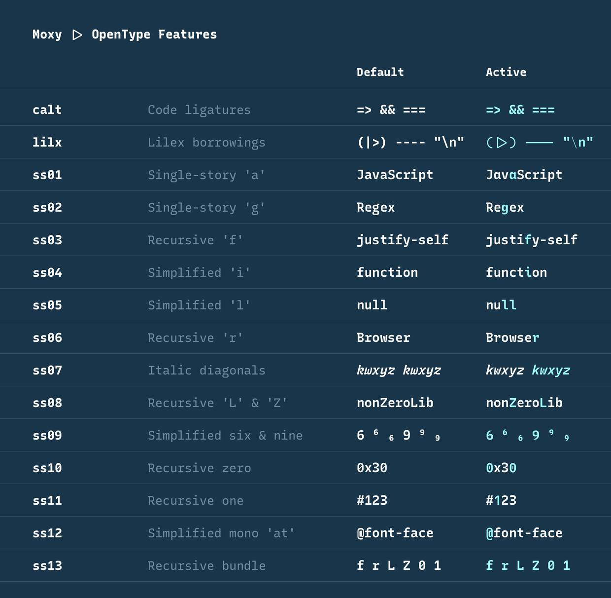

<p align="center">
  
</p>

**Moxy** is a monospaced coding font that is ultra legible and has flair. One
might even say it has ... character.

It's built on the bones of [Recursive](https://www.recursive.design/) with a few
specific choices around alternative characters. It then folds in a handful of
code-friendly glyphs from [Lilex](https://github.com/mishamyrt/Lilex).

It comes together beautifully as mainstay font for programmers.

## Install

**Homebrew (recommended):**

```bash
brew install --cask kaushikgopal/tools/font-moxy
```

**Manual:** download the latest `moxy-<version>.zip` from
[Releases](https://github.com/kaushikgopal/font-moxy/releases/latest), unzip,
and install the `.ttf` files (macOS: open them in Font Book).

### Use it

The Homebrew cask installs the static family as **`Moxy Static`**. The static
fonts bake in the Moxy look, so no OpenType feature toggles are needed.

For example in [Ghostty](https://ghostty.org):

```ini
font-family = Moxy Static
font-size = 13.5
adjust-cell-height = 9
```

If you build/install the variable font yourself, use the **`Moxy`** family and
turn on the opt-in Moxy features:

```ini
font-family = Moxy
font-feature = moxy,lilx
font-variation = CASL=1
```

`wght=375` is already the variable font's default, so leave it out unless you
want a different weight. In Ghostty, setting a redundant `wght=375` can interfere
with the visible `CASL` change on macOS.

Most editors keep contextual alternates (`calt`) on by default; Moxy uses `calt`
for the always-on long-arrow repair. The variable font's `moxy` / `lilx` toggles
are custom features, so enable them explicitly where your editor supports
OpenType feature settings. In VS Code:

```jsonc
"editor.fontLigatures": "'calt', 'moxy', 'lilx'"
```

## What's different from Recursive

<p align="center">
  
</p>

The **variable font** (see [CUSTOMIZING.md](CUSTOMIZING.md)) stays close to
Recursive — Recursive's own feature tags (`ssNN`, `titl`, `dlig`, …) mean what
they mean in Recursive, opt-in the same way. Moxy adds two forward opt-in
features on top:

- `moxy` — turn **on** the Moxy letterform set: single-story `g`, simplified
  `f r 6 9 1`, dotted `0`, fancy long-tail `Q`.
- `lilx` — turn **on** the Lilex borrowings: curvy parens, connected
  `|>` / `<|` bars, connected dashes, thin escape backslash.
- `ss02 / ss03 / ss06 / ss09 / ss10 / ss11 / titl` — enable one letterform at
  a time (these compose with `moxy`).

```ini
# full Moxy look from the Moxy variable font
font-feature = moxy, lilx
# plain Recursive = bare font (no features)
```

> The added arrow characters and the long-arrow fix are additive and always on.
> These toggles live in the **variable font**; the static styles shipped via the
> cask are frozen to the look you see by default.

## Everything else is Recursive

Moxy inherits Recursive's design. It's a pure monospace font, so Recursive's
Monospace axis is locked to Mono and dropped; the variable font keeps the other
four axes (Casual, Weight, Slant, Cursive). For the full story on Recursive,
see [recursive.design](https://www.recursive.design/).

## Build / customize from source

Moxy is generated from the Recursive variable font plus a small set of scripts.
See **[CUSTOMIZING.md](CUSTOMIZING.md)** to build the static fonts, build the
variable font, tweak which features are baked in, or cut a release.

## OpenType features

<p align="center">
  
</p>

## Attribution & license

**Moxy the font is licensed under the [SIL Open Font License 1.1](OFL.txt)**,
with **"Moxy" as a Reserved Font Name.** That's a deliberate choice, not an
accident:

- It **requires attribution** — anyone who redistributes Moxy (modified or not)
  must keep the copyright + license notices.
- The **Reserved Font Name means you may not ship a modified version still
  called "Moxy"** — fork it all you like, but rename your fork.

Moxy has to be OFL-1.1 because it's a derivative of two OFL-1.1 typefaces, whose
notices must be kept:

- **[Recursive](https://github.com/arrowtype/recursive)** by Arrow Type /
  Stephen Nixon — the base design and variable font (SIL OFL 1.1).
- **[Lilex](https://github.com/mishamyrt/Lilex)** by Mikhael Khrustik — the
  borrowed code glyphs (SIL OFL 1.1).

The full text and all three copyright lines are in [`OFL.txt`](OFL.txt) (also
bundled in each release, alongside `Lilex-OFL.txt`). Separately, the **build
tooling/scripts** in this repo are MIT licensed (see [`LICENSE`](LICENSE),
inherited from Arrow Type's `recursive-code-config`).

Issues with the build workflow → file them here. Issues with the underlying
shapes → upstream at [Recursive](https://github.com/arrowtype/recursive/issues)
or [Lilex](https://github.com/mishamyrt/Lilex/issues).
