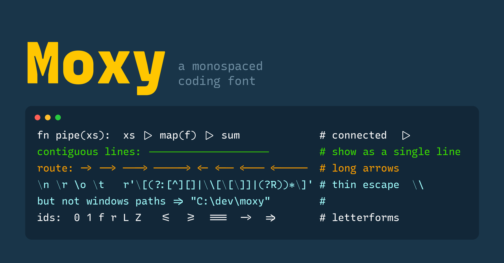
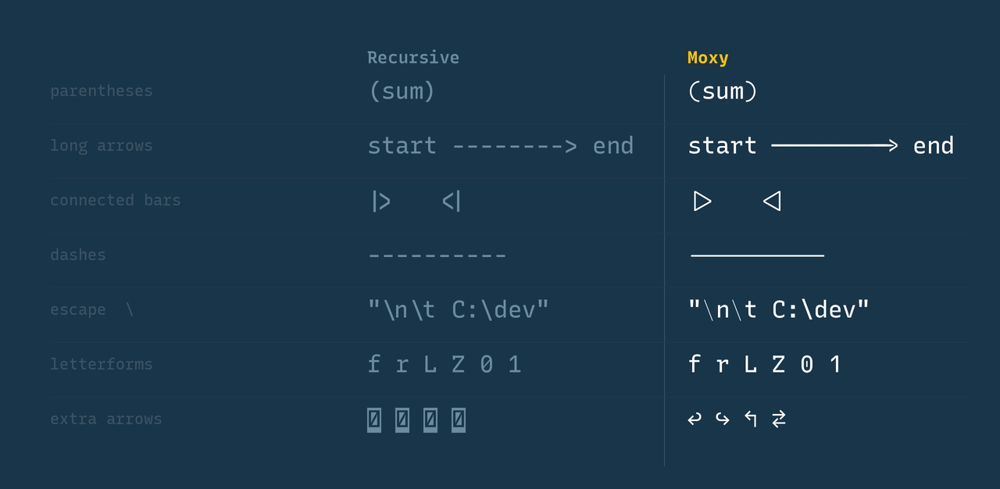

<p align="center">
  
</p>

**Moxy** is a monospaced\* coding font that is ultra legible and has flair. One
might even say it has ... character.

`*` - it's monospaced only by default but can be feature set to be a Sans font.

It's built on the bones of [Recursive](https://www.recursive.design/) with a few
specific choices around alternative characters. It then folds in a handful of
code-friendly glyphs from [Lilex](https://github.com/mishamyrt/Lilex).

It comes together beautifully as mainstay font for programmers.

## Install

**Homebrew (recommended):**

```bash
brew install --cask kaushikgopal/tools/font-moxy
```

**Manual:** download the latest `moxy-<version>.zip` from
[Releases](https://github.com/kaushikgopal/font-moxy/releases/latest), unzip,
and install the `.ttf` files (macOS: open them in Font Book).

### Use it

Set the family name to **`Moxy`** in your editor / terminal.

For example in [Ghostty](https://ghostty.org):

```ini
font-family = Moxy
# below are my preferences
adjust-cell-height      = 10
font-size               = 13
font-variation          = wght=375
```

Most editors enable contextual ligatures (`calt`) by default, which is what Moxy
uses for connected dashes, long arrows, and the rest. In VS Code, turn them on
with:

```jsonc
"editor.fontLigatures": true
```

## What's different from Recursive

Compared to stock Recursive Mono Casual, Moxy changes these by default:

<p align="center">
  
</p>

The **variable font** (see [CUSTOMIZING.md](CUSTOMIZING.md)) additionally lets
you dial these back toward Recursive with opt-in features:

- `lilx` — turn **off** the Lilex tweaks (parens, connected dashes/bars, thin
  backslash) and get Recursive's shapes back.
- `ss13` — "Alt. Recursive choices": restore Recursive's `f r L Z 0 1`.
- `ss03 / ss06 / ss08 / ss10 / ss11` — restore one letterform at a time.

Enabling `lilx` **and** `ss13` returns the (revertible) glyphs to pristine
Recursive. In Ghostty:

```ini
# plain Recursive look from the Moxy variable font
font-feature = lilx, ss13
```

> The added arrow characters and the long-arrow fix are additive and always on.
> These toggles live in the **variable font**; the static styles shipped via the
> cask are frozen to the look you see by default.

## Everything else is Recursive

Moxy inherits Recursive's design and its five variable axes (Monospace, Casual,
Weight, Slant, Cursive) in the variable font. For the full story on Recursive,
see [recursive.design](https://www.recursive.design/).

## Build / customize from source

Moxy is generated from the Recursive variable font plus a small set of scripts.
See **[CUSTOMIZING.md](CUSTOMIZING.md)** to build the static fonts, build the
variable font, tweak which features are baked in, or cut a release.

## Attribution & license

**Moxy the font is licensed under the [SIL Open Font License 1.1](OFL.txt)**,
with **"Moxy" as a Reserved Font Name.** That's a deliberate choice, not an
accident:

- It **requires attribution** — anyone who redistributes Moxy (modified or not)
  must keep the copyright + license notices.
- The **Reserved Font Name means you may not ship a modified version still
  called "Moxy"** — fork it all you like, but rename your fork.

Moxy has to be OFL-1.1 because it's a derivative of two OFL-1.1 typefaces, whose
notices must be kept:

- **[Recursive](https://github.com/arrowtype/recursive)** by Arrow Type /
  Stephen Nixon — the base design and variable font (SIL OFL 1.1).
- **[Lilex](https://github.com/mishamyrt/Lilex)** by Mikhael Khrustik — the
  borrowed code glyphs (SIL OFL 1.1).

The full text and all three copyright lines are in [`OFL.txt`](OFL.txt) (also
bundled in each release, alongside `Lilex-OFL.txt`). Separately, the **build
tooling/scripts** in this repo are MIT licensed (see [`LICENSE`](LICENSE),
inherited from Arrow Type's `recursive-code-config`).

Issues with the build workflow → file them here. Issues with the underlying
shapes → upstream at [Recursive](https://github.com/arrowtype/recursive/issues)
or [Lilex](https://github.com/mishamyrt/Lilex/issues).
